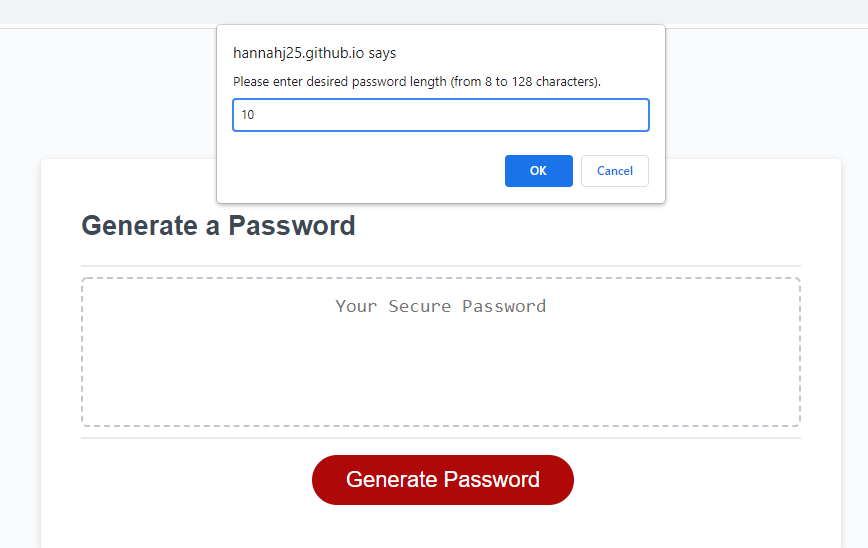
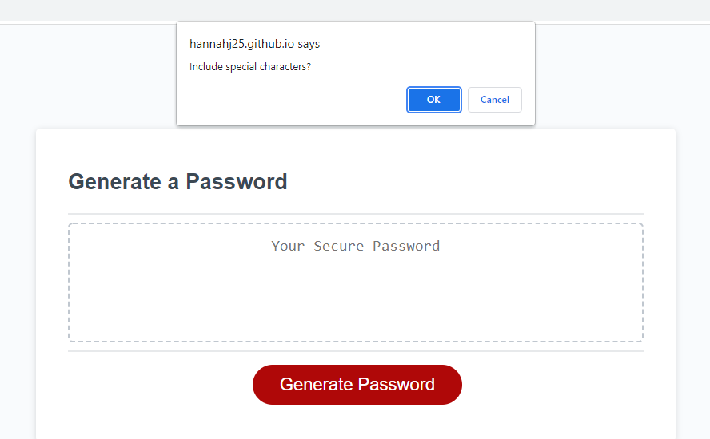
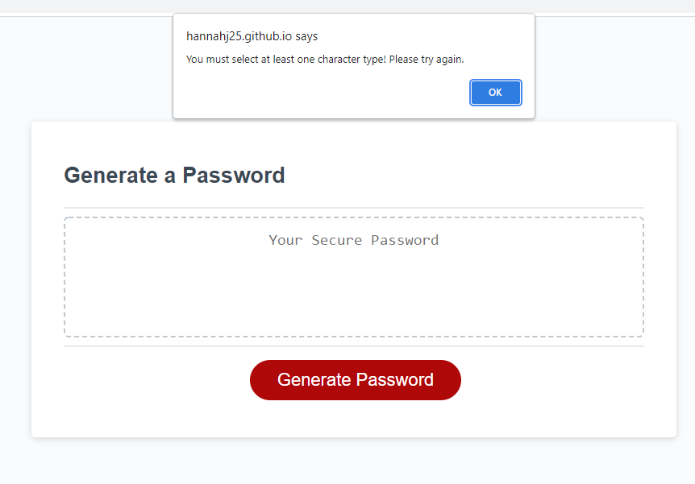
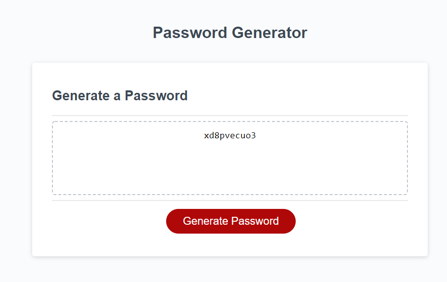

# Password Generator

 ## Purpose

 This web application is designed to generate a random password based on the user's selected criteria.

 ## Details

 Upon clicking the 'Generate Password' button, the user is taken through a series of prompts to determine the length of their password, and which character types they wish to be included in it. If they select invalid criteria (i.e. too short/long password or no selected character types), they are informed with a pop-up message and asked to try again. When they have successfully set criteria for their password, it is randomly generated and displayed to the page.

 ## Screenshots

 ## Link

 https://hannahj25.github.io/password-generator/

 ## Acknowledgements

 This project was built off of starting code provided by the University of Adelaide's Coding Boot Camp.

